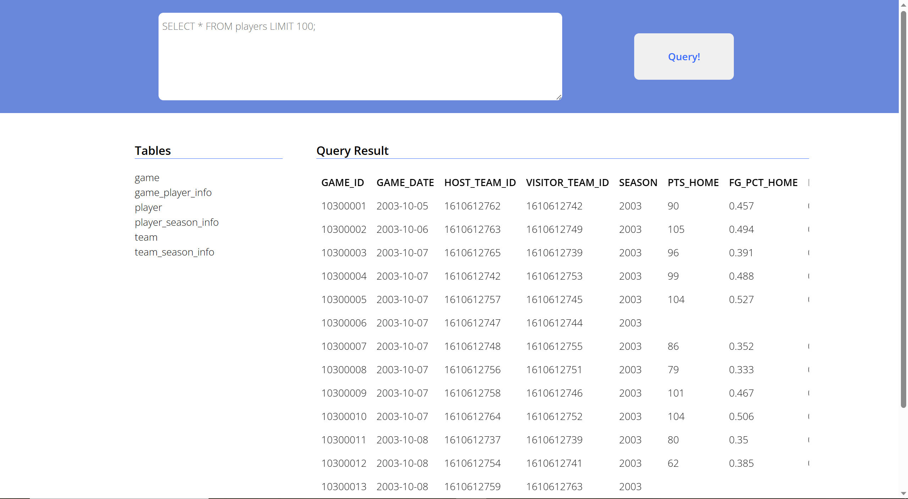

# NBA Data System

View our [webpage](http://47.242.150.253:39017/).

## Members

- Jiayang Yu
- Junyuan Deng
- Dongming Li
- Jingqi Wu
- Zhehan Zhang
- Chenyi Li
- Yingyi Huang

## ER Diagram


## Conda Environment

Follow the requirements.txt.

```bash
conda activate <env>
$ while read requirement; do conda install --yes $requirement || pip install $requirement; done < requirements.txt
```

If the command above failed, do

```bash
pip install
```

to the failed packages.

Or alternatively, simply use:

```bash
conda create -n csc3170 python=3.7 mysql-connector-python pandas flask flask-cors
```

`flask` and `flask-cors` are for backend service. If you do not wish to build the backend server, only `pandas` and `mysql-connector-python` is required.

Note: `python<3.8` is required for `mysql-connector-python`.

## Database Schema

### MySQL Workbench run sql file

Run `schema.sql` in mysql workbennch.

## Data Import

### MySQL WorkBench Table Import Wizard

Need to handle the null values in the csv files before importing the data to the database:

```bash
# We have prepared the content in prepare_data before the analysis
# Never execute
python prepare_data.py
```

### Python Insertion Script (recommended)

```bash
python insert_data.py
```

Note that to use the insertion script, you need to configure your username and password. See section [Running Backend Server](#running-backend-server) for instructions.

## Indexing

Refer to [`index.sql`](index.sql) for index creation and deletion.

Since our database is relatively small, indices bring little speedup compared with no indexing if any.

### Speed Comparison

Use the following command to calculate the speed of a query (using 10 repetitive queries):

```bash
python utility/test_query_speed.py -q "<your-query>" -n 10
```

Note that on Linux, multi-line query is supported as long as it is enclosed by `""`. On Windows, multi-line query would not work.

For the query below, we report the speed with and without indices.

Query 1:

```sql
select * from game_player_info where player_position='C';
```

Query 2:

```sql
select * from game where season=2021;
```

Query 3:

```sql
SELECT TEAM_NAME, AVG(FG_PERCENTAGE) AS AVG_FG_PERCENTAGE
FROM team_season_info as ts, team
WHERE SEASON = 2021 and ts.TEAM_ID = team.TEAM_ID
GROUP BY ts.TEAM_ID
ORDER BY AVG_FG_PERCENTAGE DESC;
```

Query 4:

```sql
SELECT gpi.PLAYER_POSITION, p.PLAYER_NAME, MAX(psi.FG_PERCENTAGE) AS MAX_FG_PERCENTAGE
FROM game_player_info gpi
INNER JOIN player p ON gpi.PLAYER_ID = p.PLAYER_ID
INNER JOIN player_season_info psi ON psi.PLAYER_ID = gpi.PLAYER_ID
WHERE psi.SEASON = 2021 AND gpi.PLAYER_POSITION IS NOT NULL
GROUP BY gpi.PLAYER_POSITION;
```

| Query | Time with index | Time without index |
| ----- | --------------- | ------------------ |
| #1    | 0.2594422s      | 0.2745347s         |
| #2    | 0.0062575s      | 0.0059074s         |
| #3    | 0.0003718s      | 0.0003521s         |
| #4    | 1.0941s         | 1.0646s            |

## Webpage Query Interface (Optional)

### Environment Setup

```bash
sudo apt update
sudo apt install npm
```





### Frontend

Run:

```bash
npm install
npm run hotloader
```

Then you should be able to view the webpage at `http://localhost:5050/`.

### Backend

#### Docker

It is recommended to use docker container for easy configuration. You may use [the docker image](https://hub.docker.com/r/mysql/mysql-server/) on docker hub.

After pulling the image,

```bash
docker run -v /mnt:/mnt -p 39000-39010:39000-39010 --name csc3170 -d mysql/mysql-server:latest
# after the container is up and running, use the following command to obtain the initial mysql password for root
docker logs csc3170 2>&1 | grep GENERATED
mysql -uroot -p<password>
```

In MySQL console, use the following command to reset the password:

```sql
ALTER USER 'root'@'localhost' IDENTIFIED BY 'password';
```

#### Potential Problems

```
mysql.connector.errors.DatabaseError: 1130 (HY000): Host '127.0.0.1' is not allowed to connect to this MySQL server
```

See [this solution](https://stackoverflow.com/a/19101356).

```
mysql.connector.errors.DatabaseError: 2059 (HY000): Authentication plugin 'caching_sha2_password' cannot be loaded: /mnt/ben/anaconda3/envs/web/lib/plugin/caching_sha2_password.so: cannot open shared object file: No such file or directory
```

See [this solution](https://stackoverflow.com/a/50130875).

#### Running Backend Server

Set up configuration first by adding the following to `server/config.json`:

```json
{
  "user": "your username",
  "password": "your password",
  "host": "127.0.0.1",
  "database": "NBA"
}
```

Then run:

```bash
cd server
python app.py
```

Note that `flask` needs to be installed first.

To test whether the service is accessible, use `python test_server.py`.

## Analytical Questions

- Find the top 10 players in terms of points per game (PPG) for the 2021 season

- Calculate the average field goal percentage (FG%) for each team for the 2021 season

- Find the player with the highest usage percentage (USG%) for each team in the 2021 season

- Calculate the average points per game (PPG) and rebounds per game (RPG) for each player position for the 2021 season

- Find the top 10 players in terms of net rating (NET_RATING) for the 2021 season

- Calculate the number of wins and losses for each team in the 2021 season

- Find the player with the highest field goal percentage (FG%) for each position in the 2021 season

- Are teams more likely to win when they are the host? If so, by how much?

- For a specific team, how does its performance change over seasons? You may use graphs to illustrate.

- For a specific player, how does his performance change over seasons? You may use graphs to illustrate.

## Requirements

1. Analyze the requirements of the organization
2. Identify the relevant entities, attributes, and relationships together with any constraints and properties
3. Produce an E-R diagram for the database
4. Convert the E-R diagrams to relational schemas (clearly indicating the primary keys, foreign keys, functional and/or multivalued dependencies, as well as justifying that your designs are in good, normalized form)
5. Populate the schemas with a reasonable amount of realistic data
6. Produce sample SQL queries on these relations that are used for practical daily operations and activities
7. Produce sample SQL queries on these relations which are of an analytic or data mining nature (this part is optional and carries extra bonus points of up to 8% of the total project mark)
8. Suggest which data fields of the relational schemas should be indexed or hashed, and explain your decision
9. Implement 4 to 6 (and possibly 7) of the above.

## Deadlines

- Apr 14: submit group info to lead TA
- Apr 21: check presentation schedule
- Apr 23: COMPELETE code, slides, presentation!!!
- Apr 24/26: presentation
- May 9: submit report

## Next meeting

Apr 19, 8pm
